# Comprehensive YARA Rules

A well-organized collection of YARA rules for malware detection and threat hunting.

[](https://opensource.org/licenses/MIT)
[](https://github.com/sivolko/comprehensive-yara-rules)

## Overview

This repository contains a comprehensive collection of YARA rules designed for malware detection and threat hunting. The rules are organized into categories based on malware types, behaviors, and threat actors, making it easy to find and use specific rules for your security needs.

## Project Architecture

```mermaid
flowchart TD
    Main[Comprehensive YARA Rules] --> MalwareRules[Malware Rules]
    Main --> RansomwareRules[Ransomware Rules]
    Main --> BackdoorRules[Backdoor Rules]
    Main --> TrojanRules[Trojan Rules]
    Main --> StealerRules[Information Stealer Rules]
    Main --> ExploitRules[Exploit Rules]
    Main --> APTRules[APT Rules]
    Main --> PackerRules[Packer Rules]
    Main --> MinerRules[Cryptominer Rules]
    Main --> WebshellRules[Webshell Rules]
    Main --> MaldocRules[Malicious Document Rules]
    Main --> AntiVMRules[Anti-Debug/Anti-VM Rules]
    Main --> CloudRules[Cloud Rules]
    Main --> Utils[Utility Scripts]
    
    CloudRules --> AWSRules[AWS Rules]
    CloudRules --> AzureRules[Azure Rules]
    CloudRules --> GCPRules[GCP Rules]
    
    MalwareRules --> Mal1[TrickBot]
    RansomwareRules --> Ran1[LockBit]
    BackdoorRules --> Back1[Cobalt Strike]
    StealerRules --> Steal1[Raccoon]
    WebshellRules --> Web1[PHP Webshells]
    APTRules --> APT1[APT41 ShadowPad]
    
    AWSRules --> AWS1[Credentials]
    AWSRules --> AWS2[Lambda Backdoor]
    AzureRules --> Azure1[Credentials]
    AzureRules --> Azure2[Functions]
    AzureRules --> Azure3[ARM Templates]
    AzureRules --> Azure4[Key Vault]
    AzureRules --> Azure5[Identity]
    AzureRules --> Azure6[Storage]
    AzureRules --> Azure7[Containers]
    AzureRules --> Azure8[Sentinel]
    AzureRules --> Azure9[Defender]
    AzureRules --> Azure10[Attack Surface]
    AzureRules --> Azure11[Networking]
    GCPRules --> GCP1[Credentials]
    GCPRules --> GCP2[Functions]
    
    Utils --> U1[Rule Indexer]
```



## Structure

The repository is organized into the following main directories:

- `malware/` - Rules for specific malware families
- `ransomware/` - Specialized rules for ransomware detection
- `backdoors/` - Rules to detect backdoors and remote access tools
- `trojans/` - Rules for trojan detection
- `information_stealers/` - Rules for infostealer detection
- `exploits/` - Rules to detect exploit code
- `apt/` - Rules for APT (Advanced Persistent Threat) groups
- `packers/` - Rules to detect packing techniques
- `cryptominers/` - Rules for crypto-mining malware
- `webshells/` - Rules for detecting webshells
- `maldocs/` - Rules for malicious document detection
- `antidebug_antivm/` - Rules for anti-debugging and anti-VM techniques
- `cloud/` - Rules for cloud environments (AWS, Azure, GCP)
  - `aws/` - Amazon Web Services specific rules
  - `azure/` - Microsoft Azure specific rules
  - `gcp/` - Google Cloud Platform specific rules
- `utils/` - Utility scripts for rule management and indexing

Each category has its own `README.md` file with more detailed information about the rules contained within.

## Usage

### Requirements

- YARA version 4.0.0 or higher
- For specific rules, additional YARA modules may be required (e.g., PE module)

### Integration

You can integrate these rules with various security tools:

1. **Command-line YARA**:
   ```bash
   yara -r rules/malware/ suspicious_file.exe
   ```

2. **Security Platforms**:
   Many security platforms support YARA rule integration, including:
   - SIEM solutions
   - Incident response platforms
   - Malware analysis sandboxes
   - Endpoint detection and response (EDR) systems

3. **Custom Tools**:
   - Use YARA's Python, Go, or C libraries to integrate rules into your own tools

## Contributing

Contributions are welcome! Please follow these guidelines:

1. Fork the repository
2. Create a feature branch (`git checkout -b feature/new-rule-set`)
3. Add your rules in the appropriate category folder
4. Ensure your rules are well-documented with:
   - Author information
   - Rule description
   - Detection logic explanation
   - References to related malware or vulnerabilities
5. Update indexes if necessary
6. Submit a pull request

Please ensure your rules are tested before submission to minimize false positives.

## Updates & Maintenance

This repository is actively maintained and updated as new threats emerge. Check the commit history for recent updates.

## License

This project is licensed under the MIT License - see the [LICENSE](LICENSE) file for details.

## Acknowledgments

This repository builds upon the excellent work of the security community, including:
- [Yara-Rules/rules](https://github.com/Yara-Rules/rules)
- [ReversingLabs/reversinglabs-yara-rules](https://github.com/reversinglabs/reversinglabs-yara-rules)
- [Neo23x0/signature-base](https://github.com/Neo23x0/signature-base)
- And many other security researchers who have contributed to YARA rule development

## Disclaimer

These rules are provided as-is without any warranty. Always test rules in a controlled environment before deployment in production systems. False positives may occur, and rules should be customized for your specific environment.
