# Cloud Infrastructure YARA Rules

This directory contains YARA rules for detecting threats, misconfigurations, and compromised resources in cloud environments.

## Architecture

```mermaid
flowchart TD
    Cloud[Cloud Rules] --> AWS[AWS Rules]
    Cloud --> Azure[Azure Rules]
    Cloud --> GCP[GCP Rules]
    Cloud --> General[Cross-Cloud Rules]
    
    AWS --> AWSCreds[Credential Leakage]
    AWS --> AWSFunction[Serverless Function Backdoors]
    AWS --> AWSMisconfig[Resource Misconfigurations]
    AWS --> AWSAttack[Attack Techniques]
    
    Azure --> AzureCreds[Credential Leakage]
    Azure --> AzureFunction[Function Backdoors]
    Azure --> AzureArm[ARM Template Vulnerabilities]
    Azure --> AzureKeyVault[Key Vault Security]
    Azure --> AzureIdentity[Identity Attacks]
    Azure --> AzureStorage[Storage Security]
    Azure --> AzureContainer[Container Security]
    Azure --> AzureSentinel[Sentinel Security]
    Azure --> AzureDefender[Defender for Cloud]
    Azure --> AzureASM[Attack Surface Management]
    Azure --> AzureNetwork[Network Security]
    
    GCP --> GCPCreds[Credential Leakage]
    GCP --> GCPFunction[Cloud Function Backdoors]
    GCP --> GCPMisconfig[Resource Misconfigurations]
    GCP --> GCPAttack[Attack Techniques]
    
    General --> AttackTech[Cloud Attack Techniques]
    
    AWSCreds --> AWS1[cloud_aws_credentials_leaked.yar]
    AWSFunction --> AWS2[cloud_aws_lambda_backdoor.yar]
    
    AzureCreds --> Azure1[cloud_azure_credentials_leaked.yar]
    AzureFunction --> Azure2[cloud_azure_function_backdoor.yar]
    AzureArm --> Azure3[cloud_azure_arm_template_vulnerabilities.yar]
    AzureKeyVault --> Azure4[cloud_azure_key_vault_suspicious_access.yar]
    AzureIdentity --> Azure5[cloud_azure_identity_attacks.yar]
    AzureStorage --> Azure6[cloud_azure_storage_security_issues.yar]
    AzureContainer --> Azure7[cloud_azure_container_security_issues.yar]
    AzureSentinel --> Azure8[cloud_azure_sentinel_security_issues.yar]
    AzureDefender --> Azure9[cloud_azure_defender_for_cloud_security_issues.yar]
    AzureASM --> Azure10[cloud_azure_attack_surface_management.yar]
    AzureNetwork --> Azure11[cloud_azure_network_security_issues.yar]
    
    GCPCreds --> GCP1[cloud_gcp_credentials_leaked.yar]
    GCPFunction --> GCP2[cloud_gcp_function_backdoor.yar]
    
    AttackTech --> Gen1[cloud_attack_techniques_general.yar]
    
    style AWS1 fill:#90EE90
    style AWS2 fill:#90EE90
    style Azure1 fill:#90EE90
    style Azure2 fill:#90EE90
    style Azure3 fill:#90EE90
    style Azure4 fill:#90EE90
    style Azure5 fill:#90EE90
    style Azure6 fill:#90EE90
    style Azure7 fill:#90EE90
    style Azure8 fill:#90EE90
    style Azure9 fill:#90EE90
    style Azure10 fill:#90EE90
    style Azure11 fill:#90EE90
    style GCP1 fill:#90EE90
    style GCP2 fill:#90EE90
    style Gen1 fill:#90EE90
```

## Categories

Rules in this directory are organized by cloud provider and resource type:

- `aws/` - Rules for Amazon Web Services resources and services
- `azure/` - Rules for Microsoft Azure resources and services
- `gcp/` - Rules for Google Cloud Platform resources and services

## Naming Convention

Rules follow this naming convention:
- `cloud_[provider]_[service]_[threat].yar` - For cloud provider-specific threat detection
- `cloud_[provider]_[config]_misconfig.yar` - For misconfiguration detection

## Use Cases

These rules can be used to detect:
- Credentials and tokens in application code and configurations
- Backdoored cloud functions/serverless resources
- Malicious cloud deployment templates
- Cloud-specific attack patterns
- Compromised cloud resources

## Testing

All rules should be tested to minimize false positives.
