# Azure Security Rules

This directory contains YARA rules for detecting threats, misconfigurations, and compromised resources in Microsoft Azure environments.

## Architecture

```mermaid
flowchart TD
    Azure[Azure Security Rules] --> Identity[Identity & Access]
    Azure --> Compute[Compute Resources]
    Azure --> Storage[Storage Resources]
    Azure --> Networking[Networking]
    Azure --> SecTools[Security Tools]
    Azure --> Templates[Templates]
    
    Identity --> IdentityRules[Identity Rules]
    IdentityRules --> IAM1[cloud_azure_credentials_leaked.yar]
    IdentityRules --> IAM2[cloud_azure_identity_attacks.yar]
    IdentityRules --> IAM3[cloud_azure_key_vault_suspicious_access.yar]
    
    Compute --> ComputeRules[Compute Rules]
    ComputeRules --> Comp1[cloud_azure_function_backdoor.yar]
    ComputeRules --> Comp2[cloud_azure_container_security_issues.yar]
    
    Storage --> StorageRules[Storage Rules]
    StorageRules --> Store1[cloud_azure_storage_security_issues.yar]
    
    Networking --> NetRules[Networking Rules]
    NetRules --> Net1[cloud_azure_network_security_issues.yar]
    
    SecTools --> SecRules[Security Tools]
    SecRules --> Sec1[cloud_azure_sentinel_security_issues.yar]
    SecRules --> Sec2[cloud_azure_defender_for_cloud_security_issues.yar]
    SecRules --> Sec3[cloud_azure_attack_surface_management.yar]
    
    Templates --> TempRules[Template Rules]
    TempRules --> Temp1[cloud_azure_arm_template_vulnerabilities.yar]
    
    style IAM1 fill:#90EE90
    style IAM2 fill:#90EE90
    style IAM3 fill:#90EE90
    style Comp1 fill:#90EE90
    style Comp2 fill:#90EE90
    style Store1 fill:#90EE90
    style Net1 fill:#90EE90
    style Sec1 fill:#90EE90
    style Sec2 fill:#90EE90
    style Sec3 fill:#90EE90
    style Temp1 fill:#90EE90
```



## Rule Categories

| Category | Purpose | Rule Count |
|----------|---------|------------|
| **Identity & Access** | Detecting credential leaks, identity attacks, suspicious Key Vault access | 3 |
| **Compute Resources** | Finding backdoors in functions and containers | 2 |
| **Storage Resources** | Detecting storage account misconfigurations and attacks | 1 |
| **Networking** | Identifying insecure network configurations | 1 |
| **Security Tools** | Detecting tampering with Microsoft Sentinel, Defender, etc. | 3 |
| **Templates** | Finding vulnerabilities in ARM templates | 1 |

## Azure Services Covered

- Azure Active Directory (AAD/Entra ID)
- Azure Functions
- Azure Storage Accounts
- ARM Templates
- Azure Key Vault
- Azure VMs
- Azure Container Instances
- Azure Application Services
- Microsoft Sentinel
- Microsoft Defender for Cloud
- Attack Surface Management
- Azure Networking

## Typical Threats

- Credential leakage in code or configuration files
- Backdoored Azure Functions
- Misconfigured ARM templates and RBAC
- Suspicious Azure AD activity
- Compromised storage accounts
- Security monitoring tampering
- Network security group misconfigurations
- Container escape techniques
- Attack path exploitation

## Usage Example

To scan files for Azure security issues using YARA:

```bash
yara -r cloud/azure/*.yar <target_directory> 
```

For more targeted scanning:

```bash
yara -r cloud/azure/cloud_azure_credentials_leaked.yar <target_directory>
```
