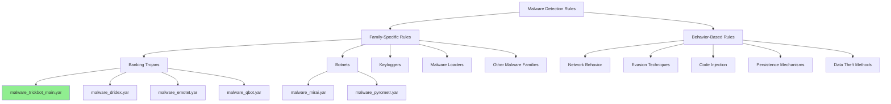

# Malware Detection Rules

This directory contains YARA rules for detecting specific malware families and generic malware behaviors.

## Architecture

## Categories

Rules in this directory are organized by malware family or behavior.

## Naming Convention

Rules follow this naming convention:
- `malware_[family]_[variant].yar` - For specific malware family detection
- `behavior_[technique]_[details].yar` - For behavior-based detection

## Testing

All rules should be tested against known samples to minimize false positives.
