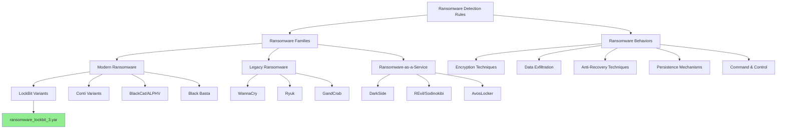

# Ransomware Detection Rules

This directory contains YARA rules for detecting different ransomware families and ransomware behavior patterns.

## Architecture

## Detection Techniques

| Technique | Description | Indicators |
|-----------|-------------|------------|
| **File Characteristics** | File markers and known patterns | Magic bytes, file headers, encryption signatures |
| **Behavioral Indicators** | Code behavior that suggests ransomware | File enumeration, encryption loops, shadow copy deletion |
| **Ransom Notes** | Detecting common ransom notes | Text patterns, HTML templates, wallpaper changers |
| **C2 Communication** | Command & control patterns | HTTP patterns, TOR connections, specific domains |
| **Post-Encryption** | Actions taken after encryption | Desktop changes, persistence mechanisms, cleanup routines |

## Categories

Rules in this directory are organized by ransomware family or behavioral indicators.

## Naming Convention

Rules follow this naming convention:
- `ransomware_[family]_[variant].yar` - For specific ransomware family detection
- `behavior_ransom_[technique].yar` - For ransomware behavior patterns

## Testing

All rules should be tested against known samples to minimize false positives.
