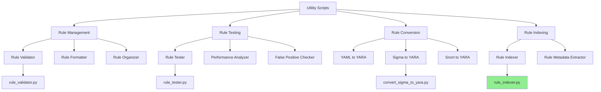

# Utility Scripts

This directory contains utilities and scripts for managing and working with the YARA rules in this repository.

## Architecture



## Available Scripts

- `rule_indexer.py` - Creates and updates indices of all YARA rules in the repository
- `rule_validator.py` - Validates YARA rules against common errors and best practices
- `convert_sigma_to_yara.py` - Converts Sigma rules to YARA format
- `rule_tester.py` - Tests YARA rules against samples for performance and false positives

## Workflow Integration

The utilities can be integrated into your workflow in the following ways:

1. **Pre-commit Validation**:
   ```bash
   ./utils/rule_validator.py --pre-commit
   ```

2. **Bulk Rule Conversion**:
   ```bash
   ./utils/convert_sigma_to_yara.py --input sigma_rules/ --output yara_rules/
   ```

3. **Rule Testing Against Samples**:
   ```bash
   ./utils/rule_tester.py --rules ransomware/ --samples malware_samples/
   ```

4. **Indexing All Rules**:
   ```bash
   ./utils/rule_indexer.py --repo-dir . --output rule_index.json
   ```

## Usage

Please refer to each script's documentation for specific usage instructions.

## Development

When developing new utility scripts, follow these guidelines:

1. Include comprehensive documentation
2. Add clear command-line arguments with help text
3. Implement proper error handling
4. Write tests for the utilities
5. Make sure the utilities work across different platforms
